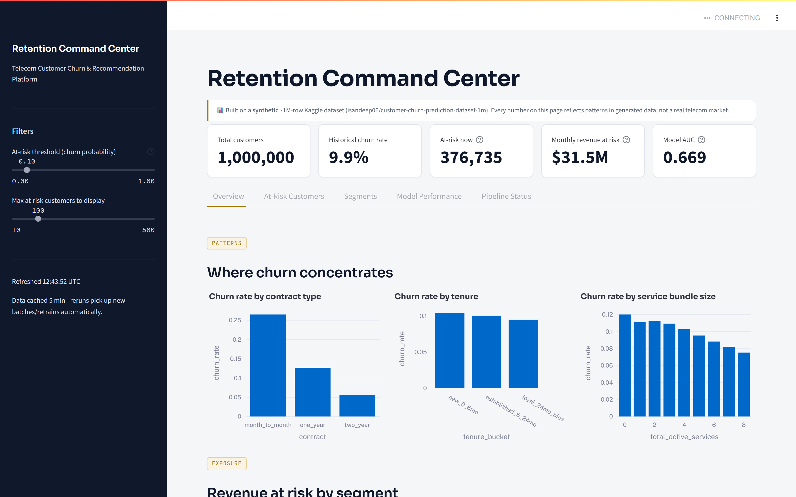
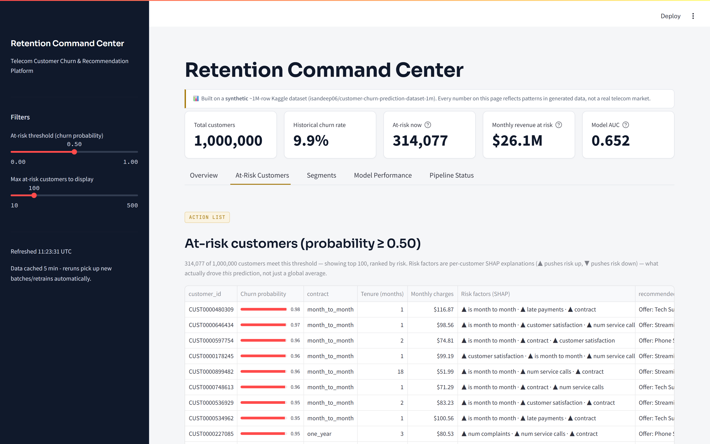
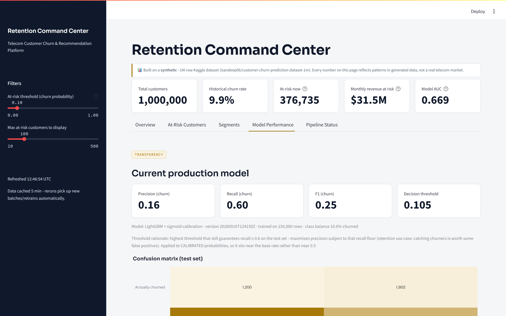
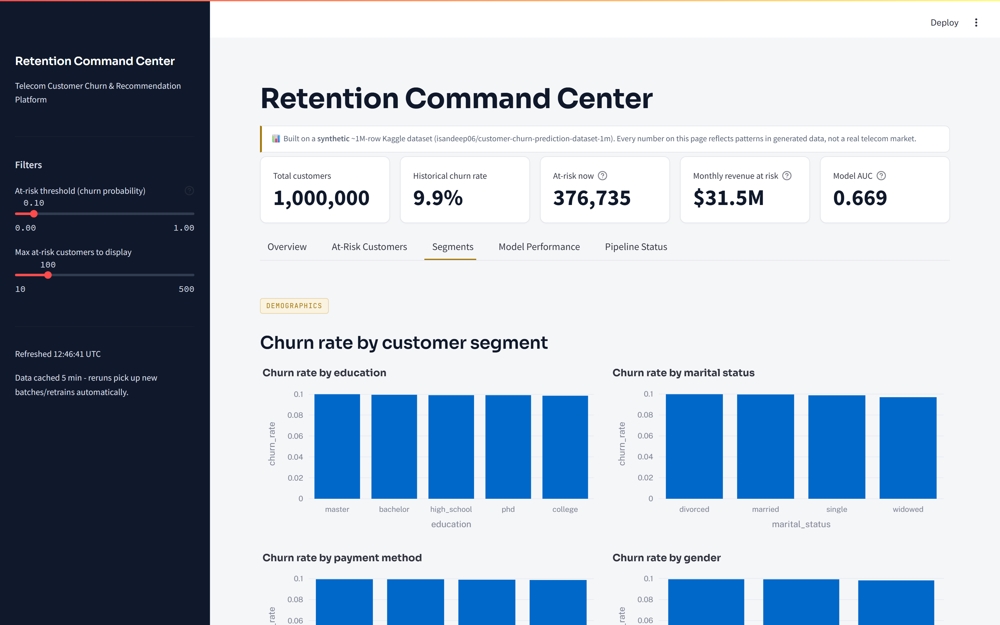
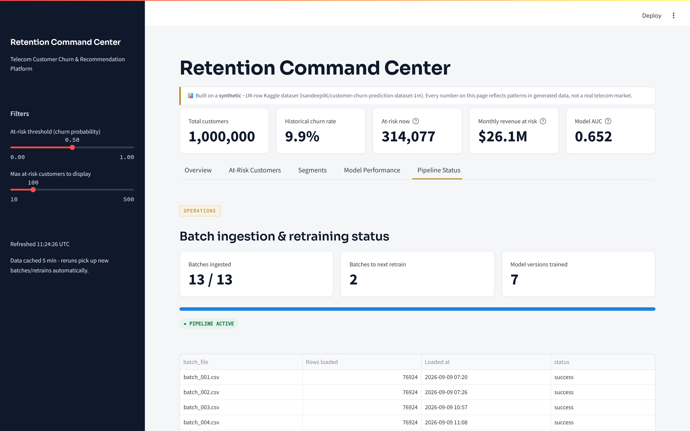
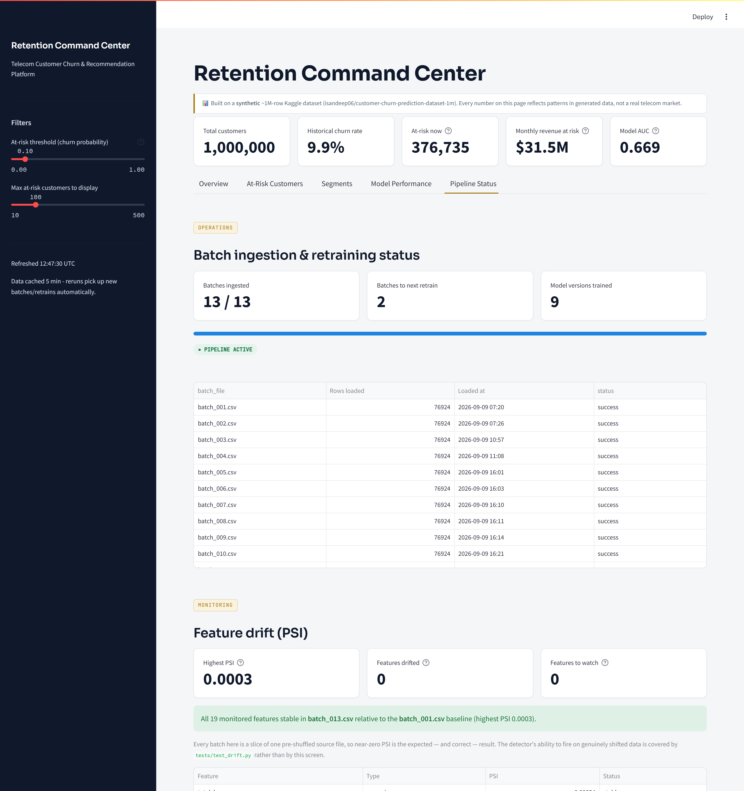

# Telecom Customer Churn & Recommendation Platform

A production-style data platform that predicts telecom customer churn and recommends services to at-risk customers, built on a large-scale synthetic dataset to demonstrate a realistic enterprise data pipeline: simulated batch ingestion, DuckDB processing, a dbt transformation layer with a Customer 360 mart, predictive modeling, and live serving — orchestrated end to end with Airflow.

## The dashboard

The platform's user-facing surface is an executive retention dashboard, served by Streamlit and scoring all 1,000,000 customers live against the latest model artifact. Every figure below is real output from a running instance, not a mockup.



Headline KPIs sit above a view selector; the banner under the title keeps the synthetic-data caveat visible on every screen rather than burying it in documentation.



The **At-Risk Customers** view is the operational one: a ranked action list where each row carries a *per-customer* SHAP explanation (▲ = pushes risk up) and a concrete next-best-offer from the recommender — not a single global feature-importance chart applied to everyone.



**Model Performance** reports the model as it actually is: AUC 0.652, recall 0.60 at the chosen threshold, and precision 0.15. The low precision is a deliberate consequence of the threshold rationale shown on the same screen — see [Limitations](#limitations) and `notebooks/threshold_and_business_value.ipynb` for why a low-precision, high-recall operating point is the correct choice for this retention problem.



The **Segments** view doubles as a visual confirmation of a negative result: churn rate is essentially flat across education, marital status, and gender. That matches the formal chi-square testing in `notebooks/eda_and_statistical_analysis.ipynb`, where none of the demographic variables reached practical significance.



**Pipeline Status** exposes the orchestration layer to the same audience: batches ingested (13/13), batches remaining until the next conditional retrain, and the number of model versions trained to date (7).

## Motivation

Customer churn is one of the most common and well-understood problems in data science, and pairing it with a recommendation system demonstrates two distinct modeling techniques within one coherent business narrative: **predict who's about to leave, then recommend something that gives them a reason to stay.**

Rather than analyze a small, pre-cleaned dataset in a notebook, this project is built as a small but complete enterprise-style data platform — using tools and patterns found in real production data teams — to make the underlying engineering, not just the modeling, part of the deliverable.

## A note on the data

This project uses the Kaggle dataset **"Customer Churn Prediction Dataset - 1M"** (`isandeep06/customer-churn-prediction-dataset-1m`), a **large-scale synthetic** telecom churn dataset: exactly 1,000,000 rows, 32 columns, one CSV. It is **not real customer data**, and every pattern or finding described in this project (including `report/findings.md`) reflects the synthetic dataset's generated structure, not an actual telecom market.

Verified properties of the source file (see `src/ingest/split_batches.py` for the profiling used):
- 1,000,000 rows, 1,000,000 unique `customer_id`s (no duplicates)
- Churn label: 90.08% retained (0) / 9.92% churned (1) — imbalanced, as real churn data typically is
- 5 columns have legitimate missing values (not errors): `annual_income` (3.0%), `customer_satisfaction` (1.99%), `num_complaints` (2.99%), `avg_monthly_gb` (5.0%), `credit_score` (4.04%)  
- Row order is already shuffled with respect to churn label and signup date (verified by checking churn rate across 10 sequential slices of the file — all landed within 9.7–10.1%), so splitting the file into sequential batches does not introduce batch-level skew

## Why DuckDB instead of Spark

The natural choice for "big data" processing is often Apache Spark. This project deliberately uses **DuckDB** instead — an in-process analytical database that handles millions of rows efficiently with a fraction of Spark's memory footprint, and has a native dbt adapter. The development machine has **8GB RAM total, and frequently under 1GB free** at any given moment (confirmed during this build - see Limitations). Running Spark alongside Postgres, Airflow, and everything else simultaneously would not be reliable on hardware like this. DuckDB delivers most of the analytical performance benefit of a distributed engine without the operational overhead, for workloads — like this one — that don't genuinely require a multi-node cluster. In practice, processing a ~77K-row simulated batch (1/13th of the dataset) through DuckDB takes well under a second.

## Architecture

```
Kaggle CSV (1,000,000 rows, synthetic)
        │  split_batches.py (one-time setup)
        ▼
13 simulated "weekly" batch files (data/raw/batch_001.csv ... batch_013.csv)
        │
        ▼
   Airflow DAG (churn_pipeline) — triggered manually per simulated arrival
        │
        ├─ ingest_next_batch ──► DuckDB: type validation (TRY_CAST),
        │                         quality-gate filtering, feature
        │                         engineering (tenure_years,
        │                         total_active_services, avg_gb_per_service)
        │                         ──► writes raw_customers +
        │                             customers_cleaned to Postgres
        │
        ├─ dbt_run  ───────────► staging (5 models) → intermediate (3 models)
        │                         → marts.customer_360 (37 dbt tests)
        ├─ dbt_test
        │
        ├─ detect_feature_drift ► PSI vs the baseline batch across 19
        │                         features ──► public.feature_drift
        │
        └─ check_retrain_needed ─┬─► retrain_churn_model (every 3rd batch OR
                                  │    any feature PSI ≥ 0.25; versioned
                                  │    artifact, never overwritten)
                                  └─► skip_retrain (otherwise)

customer_360 (one row per customer: demographics, account, services,
              usage, value segmentation, churn label)
        │
        ├──────────────────────────────┬──────────────────────────────┐
        ▼                              ▼                              ▼
  train_churn.py                train_recommender.py           Streamlit dashboard
  (LightGBM,                    (k-NN over profile                (reads customer_360
   class_weight=balanced)        vectors, content-based)            directly, scores it
        │                              │                             live with the latest
        ▼                              ▼                             model artifacts)
  models_store/                 models_store/
  churn_model_<ts>.joblib       recommender_<ts>.joblib
        │                              │
        └──────────────┬───────────────┘
                        ▼
              FastAPI (src/model/api.py)
        POST /predict-churn   POST /recommend
     (loads latest artifact of each at startup,
      no live DB dependency at request time)
```

## Repository Structure

```
.
├── dags/
│   └── churn_pipeline.py          # Airflow DAG: ingest -> dbt run/test -> drift check -> conditional retrain
├── src/
│   ├── warehouse.py               # server-side-cursor streaming reads (see Deviations)
│   ├── ingest/
│   │   ├── split_batches.py       # one-time: splits the Kaggle CSV into 13 batch files
│   │   └── batch_loader.py        # picks up next batch, DuckDB clean/validate/engineer, loads to Postgres
│   ├── model/
│   │   ├── train_churn.py         # trains + evaluates the churn classifier, saves versioned artifact
│   │   ├── train_recommender.py   # trains the content-based recommender, saves versioned artifact
│   │   ├── threshold_analysis.py  # expected-value threshold selection (cost/benefit model)
│   │   └── api.py                 # FastAPI app: /predict-churn and /recommend
│   ├── monitoring/
│   │   └── drift.py               # PSI drift detection between batches (see Drift monitoring)
│   └── dashboard/
│       └── app.py                 # Streamlit dashboard, reads customer_360 directly
├── dbt/
│   ├── models/
│   │   ├── staging/                # 5 models: demographics, account, services, usage, churn
│   │   ├── intermediate/           # 3 models: service summary, usage summary, value segment
│   │   └── marts/customer_360.sql  # the unified customer view
│   ├── macros/generate_schema_name.sql
│   ├── dbt_project.yml
│   └── profiles.yml
├── db/
│   └── schema.sql                  # raw_customers, customers_cleaned, ingestion_log, feature_drift DDL
├── data/
│   └── raw/                        # batch_001.csv ... batch_013.csv (gitignored, regenerate via split_batches.py)
├── notebooks/
│   ├── model_dev_offline.py                    # offline model-comparison experiment
│   ├── eda_and_statistical_analysis.ipynb      # significance tests, survival analysis, clustering, SHAP
│   └── threshold_and_business_value.ipynb      # expected-value threshold + calibration analysis
├── tests/
│   ├── fixtures/sample_batch.csv
│   ├── test_ingest.py              # 7 tests: DuckDB cleaning/validation/feature logic
│   ├── test_model.py               # 13 tests: expected-value math, threshold selection, recommender invariants
│   └── test_drift.py               # 18 tests: PSI correctness, incl. shifts the detector must catch
├── docs/
│   └── images/                     # dashboard screenshots used in this README
├── report/
│   └── findings.md                 # business-facing write-up (synthetic-data caveat up front)
├── docker/
│   ├── Dockerfile.airflow
│   ├── Dockerfile.api
│   ├── Dockerfile.dashboard
│   ├── requirements-airflow.txt
│   └── init-multi-db.sh
├── docker-compose.yml
├── .github/workflows/ci.yml
├── requirements.txt
├── pytest.ini
├── .env.example
└── .gitignore
```

## The Customer 360 concept

**Customer 360** is a standard enterprise data pattern: a single, unified table consolidating everything known about a customer — demographics, account details, service subscriptions, usage, and churn risk — instead of that information being scattered across tables that must be joined every time it's needed.

`marts.customer_360` is dbt's final mart model: one row per customer, built by joining 5 staging models and 3 intermediate models. It is the **only** table the churn model, the recommender, and the Streamlit dashboard read from.

### dbt lineage

```
sources: public.customers_cleaned, public.raw_customers  (written by batch_loader.py)
        │
        ▼
staging/  stg_customers__demographics   stg_customers__account   stg_customers__services
          stg_customers__usage          stg_customers__churn
        │
        ▼
intermediate/  int_customer_service_summary   (services x account: cost per active service)
               int_customer_usage_summary     (usage x account: complaints per tenure-month, disengagement flag)
               int_customer_value_segment     (demographics x account: income/spend ratio, tenure bucket)
        │
        ▼
marts/  customer_360   (all of the above, joined on customer_id)
```

37 dbt tests (`not_null`, `unique`, `accepted_values`) run across all three layers — all passing as of the last verified run (see "Verified state" below).

## Statistical & analytical depth

Beyond the production pipeline, `notebooks/eda_and_statistical_analysis.ipynb` is a fully executed (not just written) analysis notebook that goes past descriptive segment charts into actual statistical methodology:

- **Significance testing**: chi-square tests (with Cramer's V effect size) for every categorical feature against churn, and Mann-Whitney U tests (with rank-biserial effect size) for every numeric feature. Finding: `contract` and `tenure_bucket` are genuinely associated with churn; `gender`, `education`, `marital_status`, and `payment_method` are **not** statistically significant at all — no demographic "churn persona" is supported by this data.
- **Statistical vs. practical significance**: at 300K+ rows, several features reach p < 0.05 with a practically negligible effect size (e.g. `monthlycharges`, hazard ratio ≈ 0.998 per dollar) — called out explicitly rather than reported as a bare "significant!" p-value.
- **Correlation & multicollinearity**: a correlation heatmap plus Variance Inflation Factors across key numeric features.
- **Survival analysis**: Kaplan-Meier curves (overall and by contract type) and a Cox Proportional Hazards model — modeling *time to churn* directly, which the binary classifier discards. `is_month_to_month` carries a hazard ratio of ~2.77 (holding other factors constant); concordance index 0.617. Kaplan-Meier: 94.7% of customers still active at 12 months tenure, 90.2% at 24, 82.1% at 48.
- **Unsupervised customer segmentation**: K-means clustering on profile features (age, income, tenure, charges, satisfaction, usage, service count), with an elbow/silhouette analysis to choose k and a PCA projection to visualize it. Reported honestly: silhouette scores are modest (~0.14–0.16), meaning the natural cluster structure is soft, not sharply separated — stated plainly rather than overclaimed.
- **SHAP explainability**: TreeExplainer on the production LightGBM model, both as a global summary plot and individual waterfall plots for specific high-risk and low-risk customers. This same SHAP logic is also used live in the **dashboard's At-Risk Customers view** (`compute_shap_risk_factors` in `src/dashboard/app.py`) — replacing an earlier global-feature-importance heuristic with real per-customer explanations (bounded to the displayed rows, not the full 1M-row table, for memory reasons).

See the notebook itself for full output, and `report/findings.md` for the business-facing summary of these findings.

## Drift monitoring

Every batch that arrives is scored against a fixed baseline batch using the **Population Stability Index**, the standard drift metric in credit-risk and churn modeling:

```
PSI = sum over bins of  (actual% - expected%) * ln(actual% / expected%)

PSI < 0.10          stable        - no action
0.10 <= PSI < 0.25  moderate      - investigate
PSI >= 0.25         significant   - retrain
```

19 features are monitored (14 numeric, 5 categorical). Results are written to `public.feature_drift` by the DAG's `detect_feature_drift` task and surfaced on the dashboard's Pipeline Status view.



This turns retraining into a two-trigger decision rather than a fixed cadence:

| Trigger | Condition | Rationale |
| --- | --- | --- |
| Cadence | every 3rd batch | the model never silently goes stale |
| Evidence | any feature PSI ≥ 0.25 | the incoming distribution no longer matches the training distribution |

Three implementation choices worth calling out, because they are where naive PSI implementations go wrong:

- **Bin edges come from the reference distribution only**, never recomputed per batch. Re-binning on the new data makes every batch look identical to itself and hides precisely the shift being measured.
- **NULLs are their own bucket**, not dropped. A feature whose missing rate jumps from 3% to 40% has drifted in the way that matters most operationally; dropping NULLs scores that as perfectly stable.
- **The outer bin edges are open** (`-inf`, `+inf`), so values beyond the reference range — the most obvious kind of drift — land in the end bins instead of being silently discarded as out-of-range.

**The honest result on this dataset: no drift, as expected.** All 13 batches are sequential slices of one pre-shuffled source file, so the maximum PSI observed across every feature and every batch pair is **0.0006** — three orders of magnitude below the "investigate" threshold. That is the correct answer for this data, not a broken detector. Evidence that the detector does fire lives in `tests/test_drift.py` (18 tests), which injects real shifts and asserts they are caught: mean shifts, variance shifts with an unchanged mean, missingness jumps, unseen categorical levels, and out-of-range values.

Run it manually against any ingested batch:

```bash
python -m src.monitoring.drift batch_013.csv
```

## How to run

### 1. Prerequisites

- Docker Desktop
- A `kaggle.json` API token at `~/.kaggle/kaggle.json` (get one from kaggle.com → Account → Create New API Token) — only needed once, to download the dataset
- Copy `.env.example` to `.env` and fill in real values (a Postgres password and Airflow admin password at minimum)

### 2. One-time data setup

```bash
kaggle datasets download -d isandeep06/customer-churn-prediction-dataset-1m -p data/raw_download --unzip
python src/ingest/split_batches.py   # writes data/raw/batch_001.csv ... batch_013.csv
```

### 3. Start the warehouse + orchestration

```bash
docker compose up -d postgres airflow-init airflow-webserver airflow-scheduler
```

Airflow UI: http://localhost:8081 (login from `.env`'s `AIRFLOW_ADMIN_USER`/`AIRFLOW_ADMIN_PASSWORD`; 8081, not the default 8080 — see Deviations). Trigger the `churn_pipeline` DAG manually — each run ingests one more batch (simulating one weekly arrival), then runs dbt, then conditionally retrains.

### 4. Train models manually (or let the DAG's retrain step do it)

```bash
python -m venv .venv && .venv/Scripts/pip install -r requirements.txt   # Windows; use bin/ on macOS/Linux
python -m src.model.train_churn
python -m src.model.train_recommender
```

### 5. Serve

```bash
docker compose --profile serving up -d api dashboard
```

- API docs: http://localhost:8000/docs
- Dashboard: http://localhost:8501

`api` and `dashboard` are behind Docker Compose's `serving` profile, so a plain `docker compose up` (warehouse + orchestration only) doesn't also pay for two more containers you may not be actively using — deliberate, given the RAM constraint.

### dbt directly

```bash
cd dbt
export DBT_PROFILES_DIR=$(pwd)   # profiles.yml lives in the project, not ~/.dbt/
dbt run
dbt test
```

### Tests

```bash
pytest tests/ -v
```

38 tests, all operating on synthetic in-memory fixtures — no database, no Docker, and no trained model artifact required, which is what lets the GitHub Actions workflow run them on a clean checkout.

| File | Tests | Covers |
| --- | --- | --- |
| `test_ingest.py` | 7 | DuckDB type coercion, quality-gate filtering, engineered-feature logic |
| `test_model.py` | 13 | expected-value math, threshold selection, recommender invariants |
| `test_drift.py` | 18 | PSI correctness, and the shifts the detector is required to catch |

## Tech stack

| Category | Tools |
|---|---|
| Languages | Python, SQL |
| Orchestration | Apache Airflow 2.10.3 (LocalExecutor) |
| Processing | DuckDB |
| Transformation | dbt-core 1.8 / dbt-postgres |
| Storage | PostgreSQL 16 |
| Modeling | LightGBM, scikit-learn (k-NN, K-means, preprocessing), pandas |
| Statistical analysis | scipy (chi-square, Mann-Whitney U), statsmodels (VIF), lifelines (Kaplan-Meier, Cox PH) |
| Explainability | SHAP (TreeExplainer) |
| Model serving | FastAPI |
| Dashboard | Streamlit, Plotly |
| Containerization | Docker, docker-compose |
| CI/CD | GitHub Actions |
| Testing | pytest, dbt tests |

## Verified state

Everything below was actually run and checked during the build, not just written and assumed to work:

- **Postgres**: up, reachable, both databases (`warehouse`, `airflow_meta`) and all three dbt schemas created.
- **Ingestion**: ran on 4 batches total (`batch_001`–`batch_004`, 2 manually + 2 via the Airflow DAG). Verified row counts, type coercion, boolean conversion, NULL preservation (null rates in `customers_cleaned` matched the source file's null rates within rounding), and feature engineering values by hand.
- **dbt**: `dbt run` builds all 9 models; `dbt test` passes all 37 tests, re-verified after every batch. `customer_360` grew in exact lockstep with batches ingested (76,924 x n), confirming append-not-replace behavior, through all 13 batches to the full **1,000,000 rows**.
- **Churn model**: originally RandomForest, trained twice via the DAG (76,924-row baseline and a 230,772-row auto-retrain), then replaced after a dedicated model-improvement investigation (`notebooks/model_dev_offline.py`) compared RandomForest/XGBoost/LightGBM/Logistic Regression, SMOTE vs. `class_weight`, and ran 5-fold cross-validation on the full 1,000,000-row dataset. **LightGBM won by a small, cross-validation-confirmed margin** (AUC 0.683 ± 0.002 vs RandomForest's 0.677 over the full 1,000,000 rows) and is now the production model, with a business-chosen decision threshold instead of the default 0.5.

  Two different numbers appear in this project and they are not interchangeable — the deployed model is the *lower* of the two, so it is the one quoted on the dashboard:

  | | Rows | ROC AUC | Purpose |
  | --- | --- | --- | --- |
  | Model-selection experiment | 1,000,000 (5-fold CV) | 0.683 ± 0.002 | choosing between model families |
  | **Deployed artifact** (`20260909T163041Z`) | 150,000 | **0.652** | what actually serves predictions |

  The deployed model trains on a 150,000-row sample because the retrain task runs in-process under Airflow's LocalExecutor on a 3.8GB Docker VM and was SIGKILLed at full scale (see Deviations); AUC was measured to be flat at 0.652–0.683 across sample sizes, so the cap costs little. Its full test-set metrics: precision 0.146, recall 0.600, F1 0.235, threshold 0.451. See "Limitations" and `report/findings.md` — this is still a modest model, and that's discussed honestly, not hidden.
- **Recommender**: trains in ~3 seconds at this scale; spot-checked recommendations are sane (only recommends services the customer doesn't already have, ranked by neighbor popularity).
- **FastAPI**: both endpoints tested with a real customer's data pulled from the warehouse. `/recommend` coverage was re-verified after the warehouse-fallback fix on 40 randomly sampled real customer IDs — 40/40 returned recommendations, against ~15% before the fix — while an ID that genuinely doesn't exist still returns 404 and the container stayed at 258MB of its 400MB limit. `/predict-churn` returned a probability consistent with that customer's actual (held-out) label; `/recommend` returned 3 ranked un-subscribed services; a 404 for an unknown `customer_id` was also verified. Re-tested after the DAG's auto-retrain to confirm the API correctly picks up and serves the newest versioned artifact — this is also what surfaced the `dill` cross-environment issue above.
- **Streamlit dashboard**: verified headlessly via Streamlit's `AppTest` runner *and* by driving the running container with headless Chromium, capturing all five views (the screenshots in this README are those captures). The browser pass found two layout defects `AppTest` structurally could not — a KPI truncated to `$26,051...` and a clipped SHAP column — both since fixed. Peak container memory during a full five-view capture: 652MB against its 2GB limit.
- **pytest**: 38/38 pass locally, and the same `pytest tests/` command is green on GitHub Actions — most recently on commit `c56ca70`, the commit that added the 18 drift tests, with the dependency-install step (lightgbm, shap, dill) succeeding on a clean Ubuntu runner. Covers ingestion logic, expected-value/threshold math, recommender invariants, and PSI drift.
- **Drift detection**: computed for all 12 non-baseline batches against the `batch_001` baseline, both from the host and from inside the `airflow-scheduler` container (proving the DAG runtime can actually execute it). Maximum PSI observed across every feature and every batch pair: **0.0006** — a correct negative result on a pre-shuffled source file, not a silent failure. The 18 tests in `tests/test_drift.py` inject genuine shifts and confirm the detector fires on them.
- **Airflow — fully verified end-to-end**, not just built. Two full DAG runs against the live webserver + scheduler (not `airflow tasks test` shortcuts): run 1 ingested `batch_003` and correctly triggered `retrain_churn_model` (3rd batch landed → branch fired, produced a new versioned artifact alongside the original, neither overwritten); run 2 ingested `batch_004` and correctly took the `skip_retrain` branch instead (4th batch, not a multiple of 3). All 7 tasks in both runs ended in `success` (or the intentionally-`skipped` branch). `customer_360` grew exactly as expected across both runs, confirmed by direct row-count query, not just DAG "green" status.

## Deviations from the original spec, and why

- **Postgres host port changed to 5433.** This machine already runs a native Windows PostgreSQL 17 service on port 5432. Docker's port-forwarding on Windows silently routed `127.0.0.1:5432` connections to that native service instead of the container, causing password-auth failures that looked like a credentials bug but weren't. Remapped the container to `5433:5432` on the host; internal container-to-container traffic (Airflow, dashboard) is unaffected since it uses the Docker network's `postgres:5432`.
- **Postgres `shm_size` raised to 256MB.** The default 64MB Docker shared-memory limit caused `customer_360`'s 7-way join to fail with "could not resize shared memory segment" once the table crossed ~150K rows. This is a known Docker-Postgres gotcha at any nontrivial join size, not specific to this dataset.
- **Added a custom `generate_schema_name` dbt macro.** Without it, dbt's default behavior prefixes custom schemas with the profile's target schema, silently writing to `public_staging`/`public_intermediate`/`public_marts` instead of the `staging`/`intermediate`/`marts` schemas created in `db/schema.sql` — two parallel, disconnected sets of schemas. Fixed by overriding the macro to use the configured schema name exactly.
- **Removed an explicit `sqlalchemy` pin from the Airflow image's requirements.** Pinning `sqlalchemy==2.0.36` force-upgraded the version Airflow 2.10.3 ships with, breaking its ORM (`TaskInstance` mapping errors) and, as a downstream effect, silently dropping the `users` CLI command group.
- **Switched `train_churn.py`/`train_recommender.py`/the dashboard off SQLAlchemy entirely, onto raw `psycopg2` connections.** Even after removing the pin above, Airflow's bundled SQLAlchemy (1.4.54) doesn't pair with pandas 2.2.3's `read_sql` "is this a SQLAlchemy connectable" detection — it silently fell back to a legacy DBAPI path and called `.cursor()` on an `Engine`/`Connection` object that doesn't have one (`AttributeError`). Passing a raw `psycopg2` connection instead sidesteps the detection entirely and works identically in and out of Docker (pandas explicitly supports arbitrary DBAPI2 connections as a fallback path, just with a benign "consider using SQLAlchemy" warning).
- **Added `PYTHONPATH=/opt/airflow` to the Airflow containers.** `docker-compose.yml` bind-mounts `./src` to `/opt/airflow/src`, but Airflow doesn't add its own working directory to `sys.path` by default, so DAG task code's `from src.ingest.batch_loader import ...` raised `ModuleNotFoundError: No module named 'src'` until this was set explicitly.
- **Airflow webserver remapped to host port 8081, not 8080.** An unrelated pre-existing project on this machine ("careerintelligence") already had its own Airflow webserver bound to 8080.
- **Added `dill` as an explicit dependency in `requirements.txt`.** A churn model retrained by the Airflow DAG failed to load in a separately-built environment (`ModuleNotFoundError: No module named 'dill'`) even though nothing in this project imports `dill` directly. Cause: Airflow's own dependency tree imports `dill`, which has the side effect of extending Python's global pickle dispatch table for that process; `joblib.dump()` of a model trained inside an Airflow task inherits that and can end up needing `dill` to unpickle elsewhere. Installing it everywhere an artifact might be *loaded* (not just where it's trained) fixes this regardless of which environment produced a given model version.
- **Ingestion writes two Postgres tables per batch (`raw_customers`, `customers_cleaned`), and dbt's staging layer reads from `customers_cleaned`, not `raw_customers`.** The spec's wording ("staging models: cleaned, typed versions of raw tables") could be read as dbt staging doing the primary cleaning. Instead, DuckDB does mechanical cleaning (type coercion, invalid-row filtering, standardizing booleans) once per batch at ingestion time — cheaper to do close to the data on arrival — and dbt staging's job is reshaping already-clean data into the staging/intermediate/marts layers, plus documentation and tests. This avoids doing the same type-coercion work twice.
- **Airflow's DAG has one `ingest_next_batch` task, not three separate "ingest / DuckDB / load" tasks.** `batch_loader.py` does all three as a single Postgres transaction by design (so a failed/retried batch never leaves the warehouse half-loaded). Splitting that into separate Airflow tasks would mean persisting intermediate DuckDB output between tasks purely to match a step count, adding fragility for no real benefit.
- **13 batches, not 10–15's midpoint.** `1,000,000 / 13 ≈ 76,924` rows/batch; chosen so that `RETRAIN_EVERY_N_BATCHES=3` produces 4 retraining events across a full run (batches 3, 6, 9, 12) — a clean demonstration of the periodic-retrain mechanism.
- **DAG is manually triggered (`schedule=None`), not on a wall-clock schedule.** A DAG run represents one simulated batch "arriving"; a real time-based schedule would misrepresent what's actually a replay of static historical data.
- **Churn model switched from RandomForest to LightGBM, plus a business-chosen decision threshold (0.451 in the current artifact, not 0.5).** The threshold is re-derived at every retrain as the highest cut-off still meeting the recall ≥ 0.60 floor, so it moves with the data rather than being a constant; it is saved inside the artifact and read back by both the API and the dashboard. Mid-build, Docker Desktop's WSL2 backend crashed after the host machine's C: drive filled to 0 bytes free during earlier image builds, corrupting the VM's disk mid-write and requiring a full machine restart to recover. While Docker/Postgres were unavailable, that downtime was used to run a dedicated model-improvement investigation (`notebooks/model_dev_offline.py`) entirely offline — reconstructing `customer_360`-equivalent data straight from the local batch CSVs via `batch_loader.py`'s own DuckDB logic, no database required. The investigation compared RandomForest/XGBoost/LightGBM/Logistic Regression and SMOTE vs. `class_weight` on the full 1,000,000-row dataset with 5-fold cross-validation, and found LightGBM gives a small, real, CV-confirmed edge (full detail in `report/findings.md`). The production `train_churn.py` and `api.py` were updated to match, and re-verified against a live `/predict-churn` request before moving on.
- **Added `libgomp1` to all three Docker images (`api`, `dashboard`, `airflow`).** After switching to LightGBM, the `api` container crashed on startup with `OSError: libgomp.so.1: cannot open shared object file` — LightGBM's native library dlopen()s GNU OpenMP at import time, which the `python:3.11-slim` base image doesn't include by default. The same import chain reaches the dashboard (via `src.model.train_churn`) and the Airflow retrain task, so all three images needed the fix, not just the one that happened to surface it first.
- **Gave the three Airflow services (`airflow-init`, `airflow-webserver`, `airflow-scheduler`) one shared `image:` tag instead of letting each build separately.** Without an explicit `image:` on the shared `x-airflow-common` anchor, Docker Compose tags each service's build by service name even when they share the exact same Dockerfile/context — so rebuilding `airflow-init` alone (to pick up the `libgomp1` fix) silently left `airflow-webserver`/`airflow-scheduler` on the stale pre-fix image. Caught by explicitly testing `import lightgbm` inside the scheduler container after a rebuild that looked successful.
- **Rewrote the dashboard's data layer to stream instead of loading the whole mart.** Once `customer_360` reached 1,000,000 rows the dashboard OOM-killed in its container: it was loading every row into a DataFrame (~620MB) and then letting the preprocessor materialize a dense 1M x 54 float64 matrix (412MB) on top, just to surface ~100 at-risk customers. It now makes one streaming pass that scores in batches and keeps only `(customer_id, churn_probability, monthlycharges)` per customer (~40MB), pulls full rows for the handful actually displayed by id, and computes every segment chart as a SQL `GROUP BY` rather than a pandas groupby over a million rows. Peak memory is now bounded by batch size rather than table size.
- **Discovered `pd.read_sql(chunksize=...)` does not bound memory with psycopg2.** psycopg2's default cursor is client-side: libpq buffers the *entire* result set before pandas sees a row, so `chunksize` only chunks an already-materialized buffer. This was the real cause behind several OOMs that earlier "chunked read" fixes only partially mitigated, and at 1M rows it fails outright with `out of memory for query result`. All warehouse reads now go through `src/warehouse.py`'s `stream_query`, which uses a named (server-side) cursor.
- **Made the recommender serve every customer, not just those in its index.** The k-NN artifact was trained on ~154K customers while `customer_360` held 1M, so id-based lookup left **84.6% of at-risk customers with no recommendation at all** in the dashboard. Added `recommend_for_profile`, which transforms any customer's profile through the saved preprocessor and matches it against the index - reframing the index as a bounded *reference set* rather than a registry of everyone. Coverage went from 15.4% to 100% with no increase in artifact size, and the profile matrix was downcast to float32 (halving it) while there.
- **Raised the dashboard container's `mem_limit` from 400MB to 768MB.** That limit was set when `customer_360` was tiny; as customer_360 grew past ~300K rows, loading the full mart into pandas plus a loaded model plus Streamlit's own baseline footprint got OOM-killed (exit 137) under the old cap.

## Limitations

- **The dataset is synthetic, not real telecom customer data.** Every "finding" in `report/findings.md` and the dashboard describes patterns the data generator produced, not an actual market.
- **DuckDB was used in place of Spark due to local hardware constraints (8GB RAM, often <1GB free in practice).** The pipeline's per-batch DuckDB step is fast at this scale (~77K rows/batch, well under a second); it was not tested against a distributed engine at larger scale.
- **Simulated batch ingestion replays a static, pre-existing dataset rather than genuine streaming arrivals**, and batches are triggered manually rather than on a wall-clock schedule (see Deviations).
- **The recommendation system uses content-based filtering only** (k-NN over demographic/account/usage profile vectors, recommending services popular among a customer's nearest neighbors). A real production system would likely combine this with collaborative filtering and online feedback signals.
- **Drift-triggered retraining is implemented, but this dataset cannot exercise it.** The pipeline computes per-feature PSI for every arriving batch and retrains when any feature crosses the 0.25 band (see [Drift monitoring](#drift-monitoring)). Because all 13 batches are slices of one pre-shuffled file, the measured drift is ~0.0004 across every feature and the cadence rule (every 3rd batch) is what actually fires in practice. The detector's ability to fire is demonstrated in `tests/test_drift.py`, not by this data.
- **Churn model performance is modest, and this was investigated, not assumed.** A dedicated experiment (`notebooks/model_dev_offline.py`) compared 4 model families, SMOTE vs. class-weighting, and cross-validated the winner on the full 1M-row dataset. Best result: LightGBM, AUC 0.683 ± 0.002 (5-fold CV) — a small, real improvement over the original RandomForest (0.677), but nothing tried closes the gap to a "strong" classifier. This looks like a genuine ceiling in the synthetic data's individual-level signal (segment-level signal is much stronger — e.g. contract type alone separates a 4.8x churn-rate gap) rather than a fixable modeling gap.
- **`/recommend` answers for any customer in the warehouse, but not identically fast for all of them.** The recommender's k-NN reference set is deliberately bounded (~154K profiles) to keep the artifact small; a customer outside it (about 85% of the 1M, so the normal case) triggers one indexed warehouse lookup and is then matched against that index. Coverage is 100% — verified on a random sample of 40 real customer IDs — but those requests do touch Postgres, unlike `/predict-churn`, which remains purely in-memory.
- **Per-customer explanations are real SHAP values, computed only for the displayed subset.** `TreeExplainer` runs against the bounded set of rows actually on screen (at most 500), never the full 1M-row table — an intentional cost/scale trade-off, not a full-population attribution.
- **Dashboard verification now includes real browser screenshots** (headless Chromium via Playwright against the running container — every image in [The dashboard](#the-dashboard) is a live capture), in addition to Streamlit's `AppTest` runner. Two rendering defects were found and fixed this way that `AppTest` could not surface, because both were layout problems rather than exceptions: a KPI value truncated to `$26,051...`, and the SHAP column clipped mid-phrase.
- **This machine's network was unusually slow throughout the build** (a 40MB Kaggle download took ~11 minutes; the Airflow Docker image took well over an hour to build, twice, due to the sqlalchemy-pin fix requiring a second build). If you rebuild on a faster connection, expect this to go much quicker.

## Author

Ly Henglong (Penguin) — Final-year ICT student, American University of Phnom Penh, focused on data science and machine learning.

- LinkedIn: [linkedin.com/in/lyhenglong](https://linkedin.com/in/lyhenglong)
- GitHub: [github.com/LyHenglong](https://github.com/LyHenglong)
